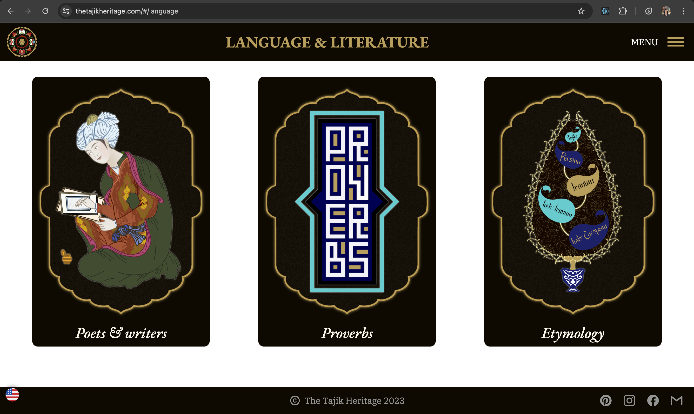

# thetajikheritage.com - Version 2

**thetajikheritage.com** is a dedicated platform showcasing the rich culture, traditions, and heritage of Tajikistan.

🚀 [Live Site](https://thetajikheritage.com)

## ❇️ Version 1
--------------------------------------------------------------------------------------------------

The initial version of the website aimed to establish the core functionality, with a focus on getting the application up and running. Data was primarily hard-coded due to the limited content on most pages.

### Technology Stack (Version 1)

- **Frontend:** React with styled-components and Material UI
- **Backend:** Node.js with Express.js & MongoDB  ➡️  [Repo Link](https://github.com/chehrona/tajikheritage_backend)
- **Deployment:** Hosted on a personal server using Docker and GitHub Pages.

## ❇️ Version 2
____________________________________________________________________________________________________

Version 2 introduces a transition to TypeScript for improved type safety and the use of CSS variables for more consistent styling. The user interface has been revamped to better handle the increasing amount of content.

### New Features

- **Responsive Design Enhancements:** Implemented media queries to improve the mobile browsing experience.
- **Loading State Management:** Added visual indicators while data is being fetched.
- **Integrated PDF Reader:** Users can now view PDF documents directly on the site.
- **Error Handling with Error Boundaries and Toasts:** Improved error management and notifications.

### Technology Stack (Version 2)

- **Frontend:** React with TypeScript, styled-components, and Material UI.
- **Backend:** Node.js with Express.js (retained from Version 1).
- **Deployment:** Hosted on a personal server using Docker and GitHub Pages (consistent with Version 1).
