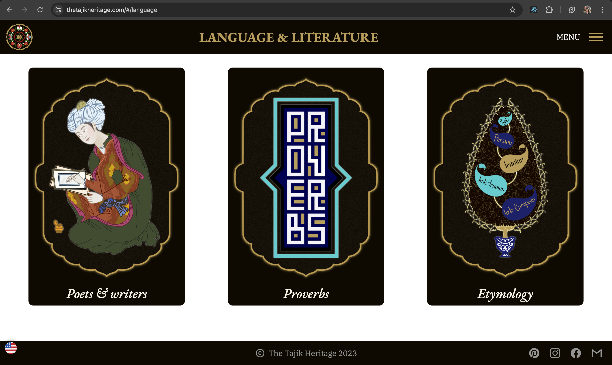

# thetajikheritage.com - Version 2

🚀 [Live Site](https://thetajikheritage.com)

**thetajikheritage.com** is an online platform dedicated to promoting Tajik culture, traditions, and heritage. This second version of the site includes enhanced features and an updated technology stack to improve user experience and performance.

## 🔸 Version 1

The first version of the website focused on getting the app started with basic functionality. Data was hard-coded since most pages had only one item.

### Technology Stack (Version 1)

- **Frontend:** React with styled-components and Material UI
- **Backend:** Node.js with Express.js & MongoDB ➡️ [Repo Link](https://github.com/chehrona/tajikheritage_backend)
- **Deployment:** Personal server using Docker and GitHub Pages.

## 🔸 Version 2

The second version transitioned the frontend to TypeScript and CSS variables, and the UI was updated to accommodate growing data.

### New Features

- **Loading State:** Displays a loading state when data is being fetched.
- **Integrated PDF Reader:** Allows users to view PDFs directly on the site.
- **Error Boundary and Toasts:** Improves error handling and user notifications.

### Technology Stack (Version 2)

- **Frontend:** React with TypeScript, styled-components, and Material UI.
- **Backend:** Node.js with Express.js (no change from Version 1).
- **Deployment:** Personal server using Docker and GitHub Pages (no change from Version 1).
